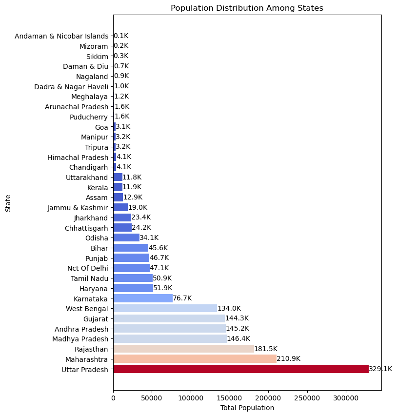
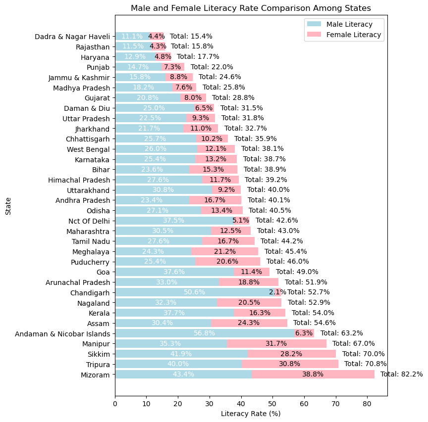

# Exploratory Data Analysis using Indian Demography details
Indian Demography Analysis using Python

## Table of Contents
1) [**1. Project Overview**](#Overview)
2) [**2. Data Processing**](#process)
3) [**3. Data Analysis with Visualizations**](#analysis)
   
     i.Population Distribution among states
   
     ii.Literacy rate Distribution among state
     

# 1. Project Overview 

## Project Deatils
This repository contains Python code snippets and guiding questions designed to help you explore and gain valuable insights from the Indian census data from 2011.

## Dataset Details
Dataset got from Indian Census website and is a open to public dataset [Link]!https://censusindia.gov.in/census.website/data/census-tables#
|Column Names  |Description                                                |
|--------------|-----------------------------------------------------------|
|State         |State Code                                                 |
|District      |District Code                                              |
|Level         |India / STATE / DISTRICT                                   |
|Name          |Name                                                       |
|TRU           |Total / Rural  / Urban                                     |
|No_HH         |No of Household                                            |
|TOT_HL_P         |Total population Person                                    |
|TOT_HL_M         |Total population Male                                      |
|TOT_HL_F         |Total population Female                                    |
|P_06          |Population in the age group 0-6 Person                     |
|M_06          |Population in the age group 0-6 Male                       |
|F_06          |Population in the age group 0-6 Female                     |
|P_SC          |Scheduled Castes population Person                         |
|M_SC          |Scheduled Castes population Male                           |
|F_SC          |Scheduled Castes population Female                         |
|P_ST          |Scheduled Tribes population Person                         |
|M_ST          |Scheduled Tribes population Male                           |
|F_ST          |Scheduled Tribes population Female                         |
|P_LIT         |Literates population Person                                |
|M_LIT         |Literates population Male                                  |
|F_LIT         |Literates population Female                                |
|P_ILL         |Illiterate Persons                                         |
|M_ILL         |Illiterate Male                                            |
|F_ILL         |Illiterate Female                                          |
|TOT_WORK_P    |Total Worker Population Person                             |
|TOT_WORK_M    |Total Worker Population Male                               |
|TOT_WORK_F    |Total Worker Population Female                             |
|MAINWORK_P    |Main Working Population Person                             |
|MAINWORK_M    |Main Working Population Male                               |
|MAINWORK_F    |Main Working Population Female                             |
|MAIN_CL_P     |Main Cultivator Population Person                          |
|MAIN_CL_M     |Main Cultivator Population Male                            |
|MAIN_CL_F     |Main Cultivator Population Female                          |
|MAIN_AL_P     |Main Agricultural Labourers Population Person              |
|MAIN_AL_M     |Main Agricultural Labourers Population Male                |
|MAIN_AL_F     |Main Agricultural Labourers Population Female              |
|MAIN_HH_P     |Main Household Industries Population Person                |
|MAIN_HH_M     |Main Household Industries Population Male                  |
|MAIN_HH_F     |Main Household Industries Population Female                |
|MAIN_OT_P     |Main Other Workers Population Person                       |
|MAIN_OT_M     |Main Other Workers Population Male                         |
|MAIN_OT_F     |Main Other Workers Population Female                       |
|MARGWORK_P    |Marginal Worker Population Person                          |
|MARGWORK_M    |Marginal Worker Population Male                            |
|MARGWORK_F    |Marginal Worker Population Female                          |
|MARG_CL_P     |Marginal Cultivator Population Person                      |
|MARG_CL_M     |Marginal Cultivator Population Male                        |
|MARG_CL_F     |Marginal Cultivator Population Female                      |
|MARG_AL_P     |Marginal Agriculture Labourers Population Person           |
|MARG_AL_M     |Marginal Agriculture Labourers Population Male             |
|MARG_AL_F     |Marginal Agriculture Labourers Population Female           |
|MARG_HH_P     |Marginal Household Industries Population Person            |
|MARG_HH_M     |Marginal Household Industries Population Male              |
|MARG_HH_F     |Marginal Household Industries Population Female            |
|MARG_OT_P     |Marginal Other Workers Population Person                   |
|MARG_OT_M     |Marginal Other Workers Population Male                     |
|MARG_OT_F     |Marginal Other Workers Population Female                   |
|MARGWORK_3_6_P|Marginal Worker Population 3-6 months Person               |
|MARGWORK_3_6_M|Marginal Worker Population 3-6 months Male                 |
|MARGWORK_3_6_F|Marginal Worker Population 3-6 months Female               |
|MARG_CL_3_6_P |Marginal Cultivator Population 3-6 months Person           |
|MARG_CL_3_6_M |Marginal Cultivator Population 3-6 months Male             |
|MARG_CL_3_6_F |Marginal Cultivator Population 3-6 months Female           |
|MARG_AL_3_6_P |Marginal Agriculture Labourers Population 3-6 months Person|
|MARG_AL_3_6_M |Marginal Agriculture Labourers Population 3-6 months Male  |
|MARG_AL_3_6_F |Marginal Agriculture Labourers Population 3-6 months Female|
|MARG_HH_3_6_P |Marginal Household Industries Population 3-6 months Person |
|MARG_HH_3_6_M |Marginal Household Industries Population 3-6 months Male   |
|MARG_HH_3_6_F |Marginal Household Industries Population 3-6 months Female |
|MARG_OT_3_6_P |Marginal Other Workers Population Person 3-6 Person        |
|MARG_OT_3_6_M |Marginal Other Workers Population Person 3-6 Male          |
|MARG_OT_3_6_F |Marginal Other Workers Population Person 3-6 Female        |
|MARGWORK_0_3_P|Marginal Worker Population 0-3 months Person               |
|MARGWORK_0_3_M|Marginal Worker Population 0-3 months months Male          |
|MARGWORK_0_3_F|Marginal Worker Population 0-3 months Female               |
|MARG_CL_0_3_P |Marginal Cultivator Population 0-3 months Person           |
|MARG_CL_0_3_M |Marginal Cultivator Population 0-3 months Male             |
|MARG_CL_0_3_F |Marginal Cultivator Population 0-3 months Female           |
|MARG_AL_0_3_P |Marginal Agriculture Labourers Population 0-3 months Person|
|MARG_AL_0_3_M |Marginal Agriculture Labourers Population 0-3 months Male  |
|MARG_AL_0_3_F |Marginal Agriculture Labourers Population 0-3 months Female|
|MARG_HH_0_3_P |Marginal Household Industries Population 0-3 months Person |
|MARG_HH_0_3_M |Marginal Household Industries Population 0-3 months Male   |
|MARG_HH_0_3_F |Marginal Household Industries Population 0-3 months Female |
|MARG_OT_0_3_P |Marginal Other Workers Population 0-3 months Person        |
|MARG_OT_0_3_M |Marginal Other Workers Population 0-3 months Male          |
|MARG_OT_0_3_F |Marginal Other Workers Population 0-3 months Female        |
|NON_WORK_P    |Non Working Population Person                              |
|NON_WORK_M    |Non Working Population Male                                |
|NON_WORK_F    |Non Working Population Female                              |

# 2. Data Processing 
The excel table was loaded checked for null and dataypes

## 2) Data Analysis and Visulaization 
     # i) What is the population distribution across different states in India?

  
    # ii) What is the literacy rate distribution across different states and between genders in India?

